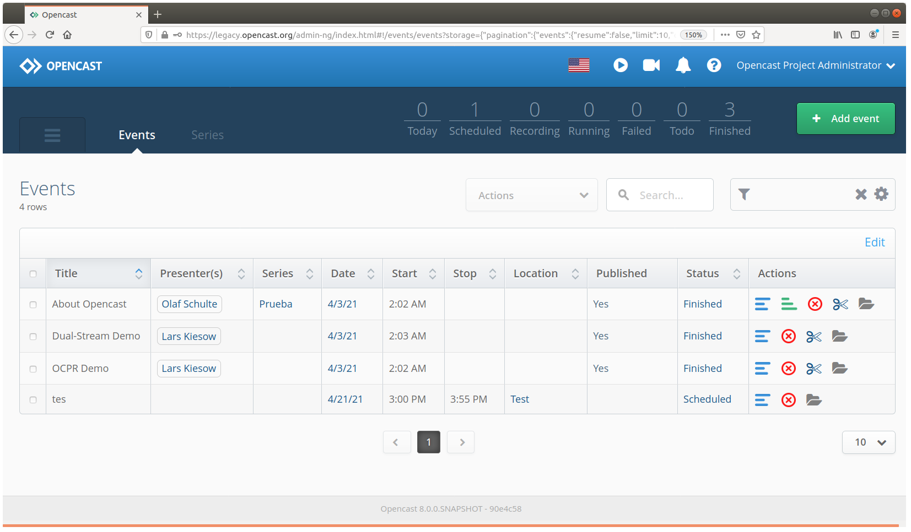

<!--
Este archivo README esta generado automaticamente<https://github.com/YunoHost/apps/tree/master/tools/readme_generator>
No se debe editar a mano.
-->

# Opencast para Yunohost

[](https://ci-apps.yunohost.org/ci/apps/opencast/)  

[](https://install-app.yunohost.org/?app=opencast)

*[Leer este README en otros idiomas.](./ALL_README.md)*

> *Este paquete le permite instalarOpencast rapidamente y simplement en un servidor YunoHost.*  
> *Si no tiene YunoHost, visita [the guide](https://yunohost.org/install) para aprender como instalarla.*

## Descripción general

Opencast is a free, open-source platform to support the management of educational audio and video content. Institutions can use Opencast to produce lecture recordings, manage existing video, serve designated distribution channels, and provide user interfaces to engage students with educational videos.


**Versión actual:** 16.5~ynh1

**Demo:** <https://stable.opencast.org/admin-ui/index.html>

## Capturas



## Documentaciones y recursos

- Sitio web oficial: <https://opencast.org/>
- Documentación administrador oficial: <https://docs.opencast.org/develop/admin/#>
- Repositorio del código fuente oficial de la aplicación : <https://github.com/opencast/opencast>
- Catálogo YunoHost: <https://apps.yunohost.org/app/opencast>
- Reportar un error: <https://github.com/YunoHost-Apps/opencast_ynh/issues>

## Información para desarrolladores

Por favor enviar sus correcciones a la [rama `testing`](https://github.com/YunoHost-Apps/opencast_ynh/tree/testing).

Para probar la rama `testing`, sigue asÍ:

```bash
sudo yunohost app install https://github.com/YunoHost-Apps/opencast_ynh/tree/testing --debug
o
sudo yunohost app upgrade opencast -u https://github.com/YunoHost-Apps/opencast_ynh/tree/testing --debug
```

**Mas informaciones sobre el empaquetado de aplicaciones:** <https://yunohost.org/packaging_apps>
