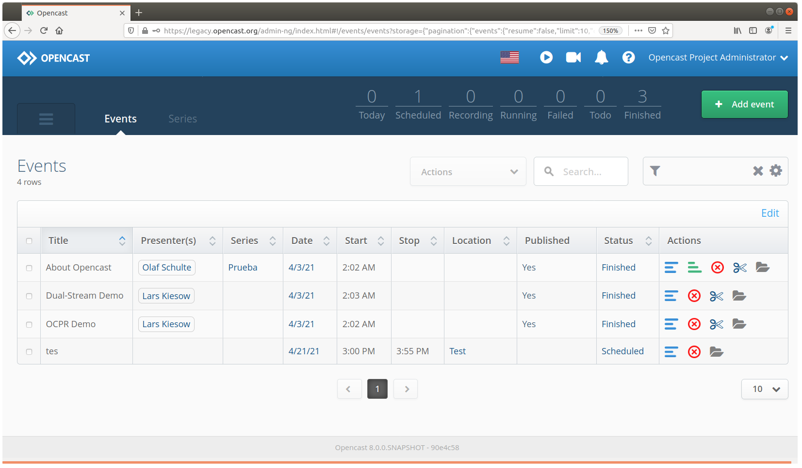

<!--
NB: Deze README is automatisch gegenereerd door <https://github.com/YunoHost/apps/tree/master/tools/readme_generator>
Hij mag NIET handmatig aangepast worden.
-->

# Opencast voor Yunohost

[](https://ci-apps.yunohost.org/ci/apps/opencast/)  

[](https://install-app.yunohost.org/?app=opencast)

*[Deze README in een andere taal lezen.](./ALL_README.md)*

> *Met dit pakket kun je Opencast snel en eenvoudig op een YunoHost-server installeren.*  
> *Als je nog geen YunoHost hebt, lees dan [de installatiehandleiding](https://yunohost.org/install), om te zien hoe je 'm installeert.*

## Overzicht

Opencast is a free, open-source platform to support the management of educational audio and video content. Institutions can use Opencast to produce lecture recordings, manage existing video, serve designated distribution channels, and provide user interfaces to engage students with educational videos.


**Geleverde versie:** 15.0~ynh1

**Demo:** <https://stable.opencast.org/admin-ui/index.html>

## Schermafdrukken



## Documentatie en bronnen

- Officiele website van de app: <https://opencast.org/>
- Officiele beheerdersdocumentatie: <https://docs.opencast.org/r/15.x/admin/#>
- Upstream app codedepot: <https://github.com/opencast/opencast>
- YunoHost-store: <https://apps.yunohost.org/app/opencast>
- Meld een bug: <https://github.com/YunoHost-Apps/opencast_ynh/issues>

## Ontwikkelaarsinformatie

Stuur je pull request alsjeblieft naar de [`testing`-branch](https://github.com/YunoHost-Apps/opencast_ynh/tree/testing).

Om de `testing`-branch uit te proberen, ga als volgt te werk:

```bash
sudo yunohost app install https://github.com/YunoHost-Apps/opencast_ynh/tree/testing --debug
of
sudo yunohost app upgrade opencast -u https://github.com/YunoHost-Apps/opencast_ynh/tree/testing --debug
```

**Verdere informatie over app-packaging:** <https://yunohost.org/packaging_apps>
